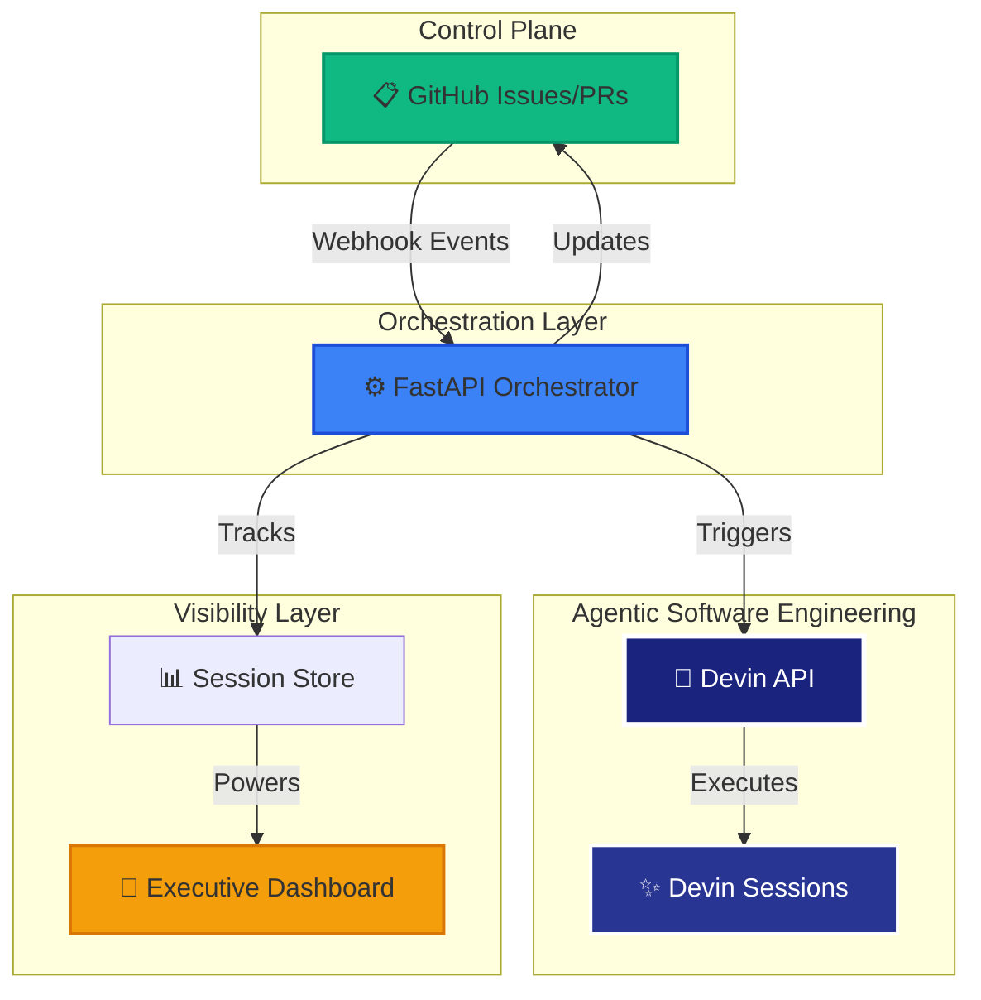

# Agentic Software Engineering Remediation

An event-driven remediation platform that helps engineering teams move from reactive issue management to an agentic operating model.

## Overview

Large engineering teams already have many signals from GitHub issues, dependency scans, static analysis, failing tests, and operational alerts. The problem is that these signals often stop at detection. Humans still need to triage, understand the codebase, apply fixes, validate changes, and open pull requests.

This system closes that gap by using Devin as an autonomous software engineering worker.

Traditional automation tells teams what is broken. Devin helps complete the engineering work.

## Demo Assets

- Target repository: https://github.com/emillaurence/superset
- Solution repository: https://github.com/emillaurence/agentic-devin-swe-remediation
- Dashboard: http://localhost:8000/dashboard (or https://your-ngrok-url.ngrok.io/dashboard)
- Example issue: https://github.com/emillaurence/superset/issues/26
- Example pull request: https://github.com/emillaurence/superset/pull/27

## Architecture

The system is built as a Python FastAPI application with the following components:



### Components

- **FastAPI Application** (`app/main.py`): REST API endpoints for webhooks, simulation, and metrics
- **Devin Client** (`app/core/devin_client.py`): Integration with the Devin API for creating autonomous sessions
- **GitHub Client** (`app/core/github_client.py`): Integration with GitHub API for issue comments and label management
- **Session Store** (`app/core/store.py`): Local JSON-based storage for tracking Devin sessions
- **Data Models** (`app/core/models.py`): Pydantic models for issues, sessions, and metrics

## Label-Driven Operating Model

The system is generic and label-driven. It uses GitHub labels to control behavior:

### Trigger Label
- `devin-remediate` - Triggers the Devin remediation workflow when added to an issue

### Risk/Category Labels
- `risk:security` - Security-focused remediation (dependencies, vulnerabilities, security fixes)
- `risk:quality` - Quality-focused remediation (code quality, maintainability, linting, static analysis)

### Status Labels
- `status:devin-running` - Automatically added when a Devin session starts
- `status:devin-needs-human-review` - Added when Devin completes remediation and opens a PR
- `status:devin-completed` - Added when remediation is reviewed and approved
- `status:devin-failed` - Added when remediation fails

## Organization Playbook Support

The app supports optional organization playbooks for Devin sessions based on GitHub risk labels. When configured, the app will automatically select and pass the appropriate playbook ID to the Devin API when creating a session.

### Playbook Configuration

Configure the following environment variables in `.env`:

- `DEVIN_SECURITY_PLAYBOOK_ID` - Used for issues labeled with `risk:security`
- `DEVIN_QUALITY_PLAYBOOK_ID` - Used for issues labeled with `risk:quality`
- `DEVIN_DEFAULT_PLAYBOOK_ID` - Used when no risk-specific playbook is configured

### Playbook Selection Logic

The app selects playbooks in the following order:

1. If issue labels include `risk:security` and `DEVIN_SECURITY_PLAYBOOK_ID` is configured, use the security playbook
2. Else if issue labels include `risk:quality` and `DEVIN_QUALITY_PLAYBOOK_ID` is configured, use the quality playbook
3. Else if `DEVIN_DEFAULT_PLAYBOOK_ID` is configured, use the default playbook
4. Else omit `playbook_id` and use the generated prompt only

If both `risk:security` and `risk:quality` are present, the app prefers `risk:security`.

### Prompt Updates

When a playbook is selected, the generated prompt includes a plain-language instruction mentioning the playbook type:

- For `risk:security`: "Apply the organization security remediation playbook and follow the issue-specific acceptance criteria below."
- For `risk:quality`: "Apply the organization quality remediation playbook and follow the issue-specific acceptance criteria below."
- For default playbook: "Apply the organization default remediation playbook and follow the issue-specific acceptance criteria below."
- If no playbook is configured: "No organization playbook was configured for this issue. Follow the issue-specific remediation instructions below."

### Session Metadata

The app stores the selected playbook information in the local session record:

- `playbook_id` - The playbook ID passed to Devin (if configured)
- `playbook_type` - One of `security`, `quality`, `default`, or `none`

The `/sessions` endpoint returns these fields for traceability. The dashboard's "Devin Session Details" tab also displays the playbook type for each session.

### Fallback Behavior

If no playbook ID is configured for a given risk category or no default playbook is configured, the app falls back to using the generated prompt guidance without a playbook. This ensures the app continues to work even without playbook configuration.

## Quick Start

### Prerequisites
- Python 3.11 or higher
- Devin API key and organization ID
- GitHub personal access token with repo permissions
- ngrok account (required for Docker Compose webhook support)

### Setup

1. Copy environment file:
```bash
cp .env.example .env
```

2. Edit `.env` with your credentials:
```bash
DEVIN_API_KEY=your_devin_api_key
DEVIN_ORG_ID=your_devin_org_id
DEVIN_ORG_SLUG=your_devin_org_slug
GITHUB_TOKEN=your_github_token
DEFAULT_GITHUB_OWNER=your_github_username
DEFAULT_GITHUB_REPO=your_target_repository
NGROK_AUTHTOKEN=your_ngrok_authtoken
```

**Getting your credentials:**

- **Devin API Key & Org ID**: Log in to https://app.devin.ai and get these from your account settings
- **Devin Org Slug**: Found in your Devin organization URL (e.g., `https://app.devin.ai/org/your-org-slug/settings`) or in organization settings
- **GitHub Token**: Create a personal access token at https://github.com/settings/tokens with `repo` permissions
- **Ngrok Auth Token**: Sign up at https://ngrok.com and get your authtoken from the dashboard

3. Run with Docker Compose (recommended):
```bash
docker compose up --build
```

Or run manually:
```bash
pip install -r requirements.txt
python -m app.main
```

The API will be available at `http://localhost:8000`

### Get ngrok URL

With Docker Compose, ngrok starts automatically. Copy the ngrok HTTPS URL from the Docker Compose logs (e.g., `https://abc123.ngrok.io`) for GitHub webhook configuration.

### Configure GitHub Webhooks

1. Go to your GitHub repository → Settings → Webhooks → Add webhook
2. Set the payload URL to your ngrok URL:
   ```
   https://your-ngrok-url.ngrok.io/webhook/github/issue
   ```
3. Content type: `application/json`
4. Events: Select "Issues"
5. For automated PR completion, add a second webhook:
   - Payload URL: `https://your-ngrok-url.ngrok.io/webhook/github/pull_request`
   - Events: Select "Pull requests"

### Test
```bash
curl http://localhost:8000/health
```

### Dashboard

Access the executive control tower dashboard at:
- **Localhost**: `http://localhost:8000/dashboard`
- **ngrok**: `https://your-ngrok-url.ngrok.io/dashboard`

## Demo Workflow

This demo shows how a labelled GitHub Issue becomes a Devin remediation session, then a reviewable pull request, with operating visibility through the dashboard.

Use the Quick Start section above to run the app and configure environment variables. The demo flow below focuses on the end-to-end workflow.

### 1. Open the dashboard

Once the app is running, open the dashboard locally:

```text
http://localhost:8000/dashboard
```

Or through your public ngrok URL:

```text
https://your-ngrok-url.ngrok.io/dashboard
```

The dashboard is the primary operating view for the demo.

### 2. Configure GitHub webhooks

The primary demo path uses GitHub webhooks. Configure webhooks as described in the Quick Start section above.

The issue webhook starts Devin only when:

```text
action = labeled
label.name = devin-remediate
```

The pull request webhook tracks PR creation, review handoff, and completion or merge state.

### 3. Label a GitHub Issue for remediation

Create or select an issue in the Superset fork.

Apply both of these labels:

| Label type          | Required label                    |
| ------------------- | --------------------------------- |
| Trigger label       | `devin-remediate`                 |
| Risk/category label | `risk:quality` or `risk:security` |

Example:

```text
devin-remediate
risk:quality
```

The `devin-remediate` label triggers the automation.

The risk/category label gives Devin context and allows the dashboard to report business impact by category.

Use:

* `risk:quality` for code quality, maintainability, linting, tests, or static analysis issues
* `risk:security` for dependency, vulnerability, or security remediation issues

### 4. Watch the remediation workflow

Once the `devin-remediate` label is added, the app:

* receives the GitHub Issues webhook
* extracts issue context and risk/category labels
* generates a Devin remediation prompt
* creates a Devin session through the Devin API
* updates the GitHub issue with status
* tracks the session and dashboard state

Devin then acts as the autonomous software engineering worker. It inspects the issue, makes a scoped remediation, validates where practical, and opens a pull request against the Superset fork.

### 5. Track PR review and completion

When Devin opens a pull request, the pull request webhook updates the workflow state.

Expected state mapping:

| Workflow state          | Meaning                                                        |
| ----------------------- | -------------------------------------------------------------- |
| `Running`               | Devin is still working and no PR exists yet                    |
| `Needs Human Review`    | Devin created a PR and human review is required                |
| `Completed`             | The PR/session completed successfully                          |
| `Needs Triage (Failed)` | Devin could not safely progress and engineer input is required |

This keeps the workflow agentic but governed:

```text
GitHub Issue → Devin Session → Pull Request → Human Review → Merge → Completed
```

### 6. Review operating visibility

Use the dashboard to show:

* estimated engineering cost saved
* reviewable PRs created
* issue-to-PR conversion rate
* risk issues in remediation
* PRs awaiting review
* active remediations and `Needs Triage (Failed)` items
* links to GitHub issues, pull requests, and Devin sessions

The dashboard answers the engineering leadership question:

> Are GitHub Issues being converted into reviewable pull requests with clear status, ROI visibility, and human review control?

### 7. Optional simulator fallback

If a live GitHub webhook is not available, use the local simulator as a fallback.

The simulator should include both the trigger label and a risk/category label, for example:

```text
devin-remediate
risk:quality
```

The simulator is useful for local testing, but the primary demo path should use GitHub webhooks.

### 8. Demo narrative

Use this narrative:

> GitHub is the control plane, FastAPI is the orchestrator, Devin is an AI coding agent and software engineer, and pull request review remains the human governance gate.

Traditional automation detects issues. This workflow uses Devin to turn labelled GitHub Issues into reviewable pull requests with status tracking, ROI visibility, and human review control.

## Documentation

For detailed information, see the documentation in the `docs/` folder:

- **[Setup Guide](docs/SETUP.md)** - Complete step-by-step setup instructions, including GitHub webhook configuration, ngrok setup, and troubleshooting
- **[Dashboard Documentation](docs/DASHBOARD.md)** - Detailed explanation of the executive control tower dashboard, KPIs, and tabs
- **[Workflow Documentation](docs/WORKFLOW.md)** - Session lifecycle, human review workflow, and sync mechanisms
- **[API Documentation](docs/API.md)** - All API endpoints with usage examples
- **[ROI Calculation](docs/ROI.md)** - How engineering cost savings are calculated

## Key Features

- **Human-in-the-loop**: Devin-generated changes require human review before completion
- **Label-driven**: Generic design works with any GitHub repository and risk labels
- **Executive dashboard**: Real-time visibility into remediation progress and ROI
- **Automated PR completion**: Sessions auto-complete when PRs are merged
- **Simple architecture**: Local JSON storage, no database required

## Design Principles

- **Simple and Reliable**: Core functionality with local JSON storage
- **Observable**: Clear logs for engineering leaders and senior engineers
- **Extensible**: Label-driven design allows easy addition of new repos, labels, and workflows
- **Safe by Default**: Minimal changes, validation checks, and human oversight

## License

Internal engineering automation system.
